# 108: Protocol State Machine for Code Hooks

// HestAI-Doc-Steward: consulted for document-creation-and-placement  
// Approved: [108-numbering] [/docs-placement] [system-architecture-scope]

**Author**: Claude Code  
**Status**: Draft  
**Created**: 2025-08-20  
**Last Updated**: 2025-08-20

## 1. Overview & Problem Statement

### The Binary Blocking Paradox

Current Claude Code quality enforcement hooks exhibit a fundamental design flaw: they operate on a **binary blocking paradigm** that cannot distinguish between:

1. **Policy Violation**: Agent actually violating established protocols (must block)
2. **Protocol in Progress**: Agent following protocols but process incomplete (must guide)
3. **Evidence Provided**: Agent following protocols with verification (must allow)

**Impact Analysis**:
- ✅ Successfully blocks dangerous LLM behaviors
- ❌ Inappropriately blocks legitimate protocol-following workflows  
- ❌ Creates false positives that interrupt valid development cycles
- ❌ Forces workarounds that compromise quality enforcement integrity

**Core Technical Issue**: Static behavior-pattern matching cannot capture dynamic protocol state, leading to temporal misclassification of legitimate actions during their execution phase.

## 2. Goals and Non-Goals

### Goals
- **State-Aware Validation**: Enable granular validation based on protocol execution state
- **False-Positive Elimination**: Eliminate blocking of legitimate protocol-following workflows
- **Quality Preservation**: Maintain rigorous enforcement of actual policy violations
- **LLM-Cognitive Compatibility**: Provide mechanical, step-by-step interfaces for protocol compliance
- **Clear Feedback**: Provide definitive guidance on protocol violations vs incomplete evidence

### Non-Goals
- **Code Execution**: This system will not execute or interpret code directly
- **Protocol Definition**: This system does not define the protocols themselves (TDD, Security, etc.)
- **Universal Coverage**: Will not attempt to handle all possible development scenarios
- **Human Decision Making**: Will not require interpretive or contextual judgment calls

## 3. Proposed Architecture

### 3.1. Core Concept: The Protocol State Machine (PSM)

**Breakthrough Insight**: Transform quality enforcement from "behavior blocking" to "protocol state shepherding"

Instead of asking "Is this behavior allowed?", the system asks "What protocol state are we in and what's the next valid transition?"

**State Machine Foundation**:
```
PROTOCOL_STATES = {
  UNINITIALIZED: "No protocol declared - default blocking active"
  PROTOCOL_DECLARED: "Agent declared compliance protocol - evidence pending"
  EVIDENCE_PENDING: "Awaiting artifacts/evidence within timeout window"
  EVIDENCE_PROVIDED: "Evidence submitted - verification in progress"
  VERIFIED: "Evidence validated - full workflow permissions granted"
  VIOLATION: "Protocol violation detected - immediate blocking"
}
```

### 3.2. State Machine Definitions

**State Transition Logic**:
```
TRANSITIONS = {
  UNINITIALIZED → PROTOCOL_DECLARED: declare_protocol(protocol_name, evidence_requirements)
  PROTOCOL_DECLARED → EVIDENCE_PENDING: begin_evidence_collection(timeout=300s)
  EVIDENCE_PENDING → EVIDENCE_PROVIDED: submit_evidence(artifacts[])
  EVIDENCE_PROVIDED → VERIFIED: validate_evidence() → SUCCESS
  EVIDENCE_PROVIDED → VIOLATION: validate_evidence() → FAILURE
  ANY_STATE → VIOLATION: detect_policy_violation()
}
```

**State Persistence Format**:
```json
{
  "current_state": "EVIDENCE_PENDING",
  "protocol": "TDD_CYCLE", 
  "declared_at": 1692547200,
  "evidence_required": ["failing_test", "implementation", "passing_test"],
  "evidence_provided": ["test_output.log"],
  "timeout_seconds": 300,
  "violations": []
}
```

### 3.3. Protocol Declaration Interfaces

**Agent Interface (Mechanical Commands)**:
```bash
# Protocol Declaration
git config protocol.declare "TDD_CYCLE"
git config protocol.evidence_type "failing_test,implementation,passing_test"
git config protocol.timeout "300"

# Evidence Submission
git protocol evidence add "test_output.log"
git protocol evidence add "src/feature.js"
git protocol evidence verify

# State Query
git protocol status  # Returns current state and requirements
```

**Supported Protocol Types**:
- `TDD_CYCLE`: Test-first development workflow
- `SECURITY_AUDIT`: Security assessment and remediation
- `CODE_REVIEW`: Peer review and approval process
- `REFACTOR_CYCLE`: Safe refactoring with regression protection

### 3.4. Hook Implementation Strategy

**Hook Chain Architecture**:

#### Pre-Commit Hook 01: Protocol Declaration Check
```bash
#!/bin/bash
# .git/hooks/pre-commit.d/01-protocol-state-declaration

if [[ ! -f ".protocol_state" ]]; then
  echo "🚨 PROTOCOL DECLARATION REQUIRED"
  echo "Available protocols: TDD_CYCLE, SECURITY_AUDIT, CODE_REVIEW, REFACTOR_CYCLE"
  echo "Usage: git config protocol.declare 'TDD_CYCLE'"
  exit 1
fi

STATE=$(jq -r '.current_state' .protocol_state)
if [[ "$STATE" == "UNINITIALIZED" ]]; then
  echo "🚨 PROTOCOL NOT DECLARED"
  echo "Run: git config protocol.declare '<PROTOCOL_NAME>'"
  exit 1
fi
```

#### Pre-Commit Hook 02: Evidence Timeout Management
```bash
#!/bin/bash
# .git/hooks/pre-commit.d/02-evidence-timeout-check

STATE=$(jq -r '.current_state' .protocol_state)
DECLARED_AT=$(jq -r '.declared_at' .protocol_state)
TIMEOUT=$(jq -r '.timeout_seconds' .protocol_state)
CURRENT=$(date +%s)

if [[ "$STATE" == "EVIDENCE_PENDING" && $((CURRENT - DECLARED_AT)) -gt $TIMEOUT ]]; then
  echo "⏰ EVIDENCE TIMEOUT: Protocol declared but evidence not provided within ${TIMEOUT}s"
  echo "Either provide evidence or reset protocol: git protocol reset"
  exit 1
fi
```

#### Pre-Commit Hook 03: Evidence Validation Engine
```bash
#!/bin/bash
# .git/hooks/pre-commit.d/03-evidence-validation

validate_tdd_evidence() {
  local has_failing_test=false
  local has_implementation=false
  local has_passing_test=false
  
  # Check for test files with failures (RED state)
  if find . -name "*test*" -newer .protocol_state -exec grep -l "FAIL\|ERROR\|Expected.*but got" {} \; | head -1 >/dev/null; then
    has_failing_test=true
  fi
  
  # Check for implementation files
  if find . -name "*.js" -o -name "*.ts" -o -name "*.py" | grep -v test | head -1 >/dev/null; then
    has_implementation=true
  fi
  
  # Check for passing tests (GREEN state)
  if find . -name "*test*" -newer .protocol_state -exec grep -l "PASS\|✓\|OK" {} \; | head -1 >/dev/null; then
    has_passing_test=true
  fi
  
  [[ "$has_failing_test" == true && "$has_implementation" == true && "$has_passing_test" == true ]]
}

validate_security_evidence() {
  # Check for security scan results
  [[ -f "security_scan.json" && -f "remediation_plan.md" ]]
}

validate_review_evidence() {
  # Check for review approval
  [[ -f ".review_checklist" ]] && grep -q "APPROVED" .review_checklist
}
```

### 3.5. Evidence Validation Frameworks

**TDD Protocol Evidence Requirements**:
```json
{
  "protocol": "TDD_CYCLE",
  "evidence_types": [
    {
      "name": "failing_test",
      "validator": "contains_test_failures",
      "required": true,
      "description": "Test file showing RED state (failing assertions)"
    },
    {
      "name": "implementation", 
      "validator": "has_source_code",
      "required": true,
      "description": "Implementation code that makes tests pass"
    },
    {
      "name": "passing_test",
      "validator": "contains_test_success",
      "required": true,
      "description": "Test file showing GREEN state (passing assertions)"
    }
  ]
}
```

**Evidence Validation Pipeline**:
```bash
validate_protocol_evidence() {
  local protocol=$1
  local evidence_dir=".protocol_evidence/"
  
  case "$protocol" in
    "TDD_CYCLE")
      validate_tdd_evidence "$evidence_dir"
      ;;
    "SECURITY_AUDIT")
      validate_security_evidence "$evidence_dir"
      ;;
    "CODE_REVIEW")
      validate_review_evidence "$evidence_dir"
      ;;
    *)
      echo "Unknown protocol: $protocol"
      return 1
      ;;
  esac
}
```

## 4. Integration Patterns

### 4.1. Workflow Integration Sequence

```mermaid
sequenceDiagram
    participant A as Agent
    participant H as Hook System
    participant PSM as Protocol State Machine
    participant V as Evidence Validator

    A->>H: Attempts commit
    H->>PSM: Check current state
    PSM-->>H: UNINITIALIZED
    H-->>A: BLOCK + Protocol declaration required
    
    A->>PSM: declare_protocol("TDD_CYCLE")
    PSM->>PSM: UNINITIALIZED → PROTOCOL_DECLARED
    A->>H: Attempts commit
    H->>PSM: Check current state
    PSM-->>H: EVIDENCE_PENDING
    H-->>A: GUIDE + Evidence required: [failing_test, implementation, passing_test]
    
    A->>PSM: submit_evidence(["test_failures.log", "feature.js", "test_success.log"])
    PSM->>V: Validate evidence
    V-->>PSM: VALID
    PSM->>PSM: EVIDENCE_PROVIDED → VERIFIED
    A->>H: Attempts commit
    H->>PSM: Check current state
    PSM-->>H: VERIFIED
    H-->>A: ALLOW + Commit permitted
```



### 4.2. HestAI Workflow Pattern Integration

**Phase Integration Points**:
- **D1-D3 (Design)**: Protocol declaration not required (design artifacts exempt)
- **B0 (Build Setup)**: Protocol declaration required for code creation
- **B1-B3 (Implementation)**: Full PSM enforcement active
- **B4 (Validation)**: Evidence verification mandatory

**Agent Sequence Coordination**:
```bash
# B3 Sequence with PSM Integration
completion-architect: git config protocol.declare "TDD_CYCLE"
universal-test-engineer: git protocol evidence add "failing_tests.log" 
security-specialist: git protocol evidence add "security_scan.json"
coherence-oracle: git protocol evidence verify
```

## 5. Security Considerations

### 5.1. State Manipulation Prevention
- **State file integrity**: SHA-256 checksums for `.protocol_state` 
- **Evidence tampering**: Cryptographic signatures for evidence artifacts
- **Timeout bypass**: Server-side timestamp validation
- **Protocol spoofing**: Whitelist of approved protocol definitions

### 5.2. Attack Vector Mitigation
- **Evidence forgery**: Multi-source evidence cross-validation
- **State persistence attacks**: Encrypted state storage with rotation keys
- **Hook bypass attempts**: Multiple validation layers with fail-safe defaults
- **Race condition exploitation**: Atomic state transitions with file locking

## 6. Alternatives Considered

### 6.1. Enhanced Pattern Matching
**Approach**: Improve existing behavior pattern matching with more sophisticated rules  
**Rejected Because**: Classification boundary errors persist; complexity increases exponentially

### 6.2. Session-Based Tracking  
**Approach**: Track agent session state across multiple operations  
**Rejected Because**: Race conditions, false positives, session management complexity

### 6.3. Evidence Recognition Systems
**Approach**: Automatic recognition of protocol compliance evidence  
**Rejected Because**: Too complex for LLM cognitive patterns; state management issues

### 6.4. Manual Review Gates
**Approach**: Human review of all blocked operations  
**Rejected Because**: Defeats automation purpose; introduces bottlenecks

## 7. Implementation Roadmap

### Phase 1: Core PSM Framework (Week 1-2)
- [ ] State file management system
- [ ] Basic protocol declaration commands
- [ ] Hook integration points
- [ ] State transition validation

### Phase 2: Evidence Validation (Week 3-4)  
- [ ] TDD protocol implementation
- [ ] Security audit protocol implementation
- [ ] Evidence validation algorithms
- [ ] Timeout management system

### Phase 3: Integration Testing (Week 5-6)
- [ ] Full workflow validation
- [ ] Edge case handling
- [ ] Performance optimization
- [ ] Security hardening

### Phase 4: Production Deployment (Week 7-8)
- [ ] Rollout strategy
- [ ] Monitoring and logging
- [ ] Incident response procedures
- [ ] Documentation and training

## 8. Success Metrics

### Quality Metrics
- **False Positive Rate**: Target < 5% (currently ~30%)
- **Protocol Compliance**: >95% successful evidence validation
- **Workflow Interruption**: <2 minutes average resolution time

### Performance Metrics  
- **Hook Execution Time**: <500ms per validation
- **State Transition Latency**: <100ms
- **Evidence Processing**: <2s for standard protocols

### Operational Metrics
- **Protocol Adoption**: >80% of workflows using PSM within 30 days
- **Violation Detection**: Maintain current 99%+ policy violation blocking
- **Agent Satisfaction**: >90% positive feedback on new system

---

**Next Actions**:
1. Implement core PSM framework components
2. Create TDD protocol validation proof-of-concept  
3. Deploy to staging environment for integration testing
4. Gather feedback from early adopter agents
5. Iterate based on real-world usage patterns